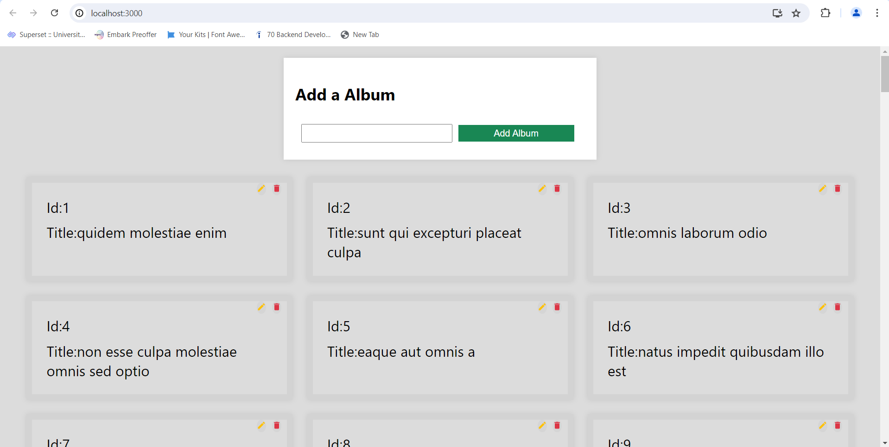

# AlbumCollection
___

## overview


It is an album collection application created using react.js. 

___

## Live Demo

- **Live Deployed Link:-** <a href="https://reactoperator.netlify.app/" target="_blank">Live</a>
___

## Features

- Fetch and display albums from an API
- Add new albums
- Update existing albums
- Delete albums
___

## Technologies Used:

[](https://skillicons.dev)

- **React.js:** Front-end JavaScript library for building user interfaces.
- **Axios:** Used for Api Calling. 
- **CSS Modules:** Modular CSS files scoped locally to each component.

___

## Installation

To run this project locally, follow these steps:

1. Clone the repository:

   ```bash
   git clone https://github.com/MdIrfan-ul/AlbumCollection.git
   ```
2. Navigate to the Project Directory:
```bash
   cd albumcollection
   ```
   
3. Install Dependencies:

 ```bash
     npm install
 ```

4. Start the development server:

```bash
npm start
```
5. Open your browser and navigate to http://localhost:3000 to view the application.

___

## Fetching Albums
Albums are fetched from the `JSONPlaceholder API` and displayed in a list.

## Adding an Album
To add an album, fill out the form at the top of the page and click "Add Album". This will send a POST request to the API and update the state with the new album.

## Updating an Album
To update an album, click the "Edit" icon on an album card. The album's title will be pre-filled in the form, allowing you to make changes. After editing, click "Update Album" to send a PUT request to the API and update the state.

## Deleting an Album
To delete an album, click the "Delete" icon on an album card. This will send a DELETE request to the API and remove the album from the state.

___

Developed with ❤️ by [Mohamed Irfanullah M]

___